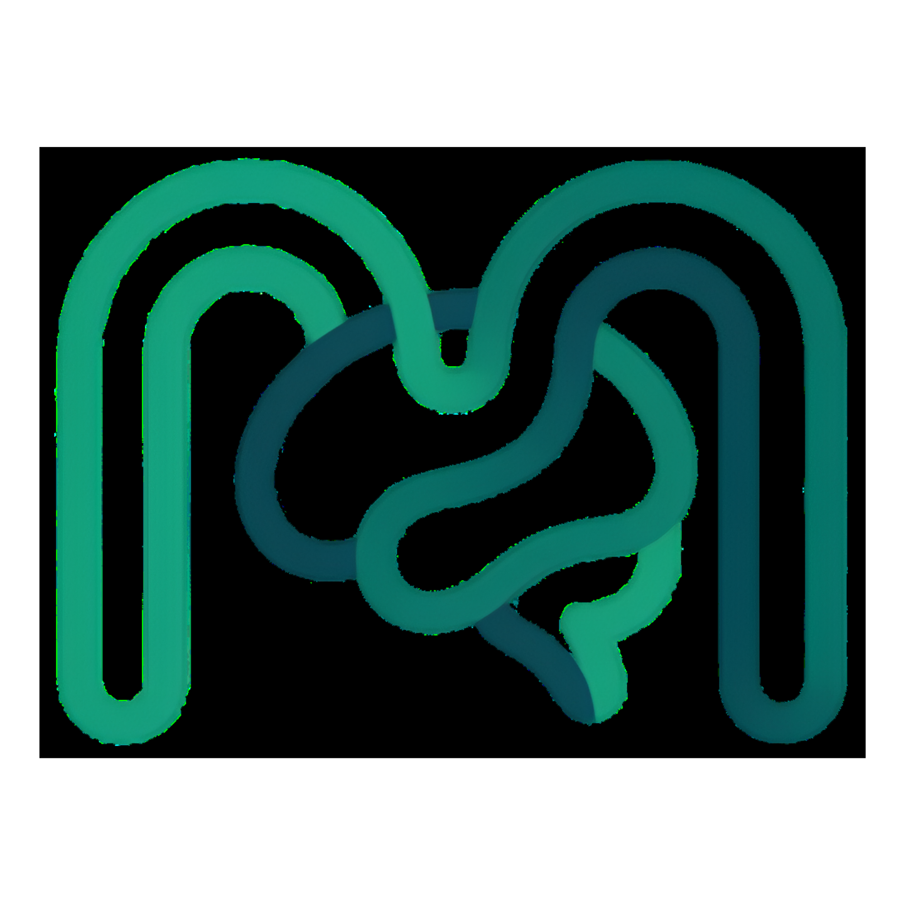

<div align="center">



# MindBloom
### Mental Wellness Space

**Platform skrining dan intervensi kesehatan mental berbasis AI untuk Indonesia**

[](https://react.dev)
[](https://www.typescriptlang.org)
[](https://supabase.com)
[](https://tailwindcss.com)
[](https://vite.dev)

</div>

---

## 🧠 Tentang MindBloom

**MindBloom** adalah platform kesehatan mental digital yang dirancang untuk menjawab krisis kesehatan mental di Indonesia. Menggunakan metode **Fuzzy Tahani** sebagai inti kecerdasan buatan, MindBloom mampu menganalisis kondisi psikologis pengguna secara fleksibel dan personal — melampaui sistem deteksi konvensional yang hanya memberikan label hitam-putih.

### Masalah yang Kami Selesaikan

| Data | Sumber |
|------|--------|
| **12 Juta+** warga Indonesia menderita depresi | Riskesdas 2018 |
| **1 dari 3** remaja mengalami masalah kesehatan mental | I-NAMHS 2022 |
| **90%** penderita tidak mendapat penanganan profesional | WHO |

> *"Masalah terbesar bukan hanya depresi — tapi banyak orang tidak sadar bahwa mereka membutuhkan bantuan."*

MindBloom hadir sebagai **pintu pertama** yang bisa diketuk kapan saja, di mana saja — tanpa biaya, tanpa stigma.

---

## ✨ Fitur Utama

### 🔍 Skrining Cerdas (Fuzzy Tahani)
- Kuesioner **PHQ-9** (depresi) dan **PSS** (stres) yang terstandar secara klinis
- Diproses dengan **logika fuzzy Tahani** untuk hasil yang nuansatif dan personal
- Output berupa **skor 0–100** dengan kategori linguistik: *Baik, Cukup, Perlu Perhatian*
- Pertanyaan adaptif yang menyesuaikan kondisi pengguna

### 🌿 Program Intervensi Dini (3 Tahap)
- **🎵 Musik Relaksasi** — 6 kategori audio (Suara Alam, Hujan Lembut, Lo-fi Relax, Gelombang Binaural, Mangkuk Tibetan, Ombak Laut)
- **🧘 Meditasi Terpandu** — Video panduan (Pernapasan, Pemindaian Tubuh, Grounding, Afirmasi)
- **📓 Jurnal Digital** — Refleksi terstruktur dengan prompt berbasis hasil skrining

### 📅 Kalender Mood
- Tracking kondisi mental harian secara visual
- Identifikasi pola mood dari waktu ke waktu
- Melihat progress pemulihan

### 🏥 Rekomendasi Psikolog
- Daftar psikolog terdekat berdasarkan lokasi
- Informasi kontak dan layanan tersedia
- Transisi mulus dari self-help ke bantuan profesional

### 🆘 Bantuan Darurat
- Akses cepat ke hotline krisis 24 jam
- Nomor darurat: **119 ext 8**
- Selalu terlihat di sidebar untuk akses instan

### 🌓 Mode Gelap / Terang
- Tema adaptif dengan animasi transisi halus
- Logo otomatis menyesuaikan tema

---

## 🛠️ Tech Stack

### Frontend
| Teknologi | Versi | Kegunaan |
|-----------|-------|----------|
| [React](https://react.dev) | 19 | UI Framework |
| [TypeScript](https://www.typescriptlang.org) | 6.0 | Type Safety |
| [Vite](https://vite.dev) | 8.0 | Build Tool |
| [Tailwind CSS](https://tailwindcss.com) | v4 | Styling |
| [Framer Motion](https://motion.dev) | 12 | Animasi |
| [React Router](https://reactrouter.com) | 7 | Routing |
| [Lucide React](https://lucide.dev) | latest | Icon Library |
| [Recharts](https://recharts.org) | 3 | Visualisasi Data |
| [Sonner](https://sonner.emilkowal.ski) | 2 | Toast Notifikasi |
| [next-themes](https://github.com/pacocoursey/next-themes) | 0.4 | Dark Mode |

### Backend & Database
| Teknologi | Kegunaan |
|-----------|----------|
| [Supabase](https://supabase.com) | Authentication, Database, Real-time |
| PostgreSQL | Penyimpanan data skrining & profil |

### AI / Logika
| Metode | Kegunaan |
|--------|----------|
| **Fuzzy Tahani** | Analisis kondisi psikologis pengguna |
| PHQ-9 | Standar skrining depresi |
| PSS | Standar skrining stres |

---

## 🚀 Cara Menjalankan Project

### Prasyarat
- Node.js **v18+**
- npm atau yarn
- Akun [Supabase](https://supabase.com) (untuk backend)

### 1. Clone Repository
```bash
git clone https://github.com/DimasPanca/Mindbloom-TryNoSleep.git
cd Mindbloom-TryNoSleep
```

### 2. Install Dependencies
```bash
npm install
```

### 3. Setup Environment Variables
Buat file `.env` di root project:
```env
VITE_SUPABASE_URL=your_supabase_project_url
VITE_SUPABASE_ANON_KEY=your_supabase_anon_key
```

> Dapatkan credentials dari [Supabase Dashboard](https://supabase.com/dashboard) → Project Settings → API

### 4. Setup Database
Jalankan migration Supabase:
```bash
# Jika menggunakan Supabase CLI
supabase db push
```
Atau import file SQL dari folder `supabase/migrations/` melalui Supabase Dashboard.

### 5. Jalankan Development Server
```bash
npm run dev
```
Buka [http://localhost:5173](http://localhost:5173) di browser.

### 6. Build untuk Production
```bash
npm run build
npm run preview
```

---

## 📁 Struktur Project

```
mindbloom/
├── public/
│   ├── audio/              # File audio untuk musik relaksasi
│   ├── logo-terang.svg     # Logo mode terang
│   └── logo-malam.svg      # Logo mode gelap
├── src/
│   ├── components/         # Komponen reusable
│   │   ├── intervention/   # Komponen MusicPlayer, VideoPlayer, JournalPrompt
│   │   └── ...
│   ├── contexts/           # React Context (Auth, Theme)
│   ├── data/               # Bank soal skrining (questions.ts)
│   ├── hooks/              # Custom React hooks
│   ├── lib/                # Utilities & Supabase client
│   ├── pages/              # Halaman utama aplikasi
│   │   ├── LandingPage.tsx
│   │   ├── DashboardPage.tsx
│   │   ├── ScreeningPage.tsx
│   │   ├── ResultPage.tsx
│   │   ├── InterventionPage.tsx
│   │   ├── MoodCalendarPage.tsx
│   │   ├── ReferralPage.tsx
│   │   ├── EmergencyPage.tsx
│   │   └── ...
│   └── types/              # TypeScript type definitions
├── supabase/
│   └── migrations/         # Database schema
└── ...
```

---

## 🔄 Alur Pengguna

```
Landing Page
    ↓
Register / Login
    ↓
Dashboard (Overview kondisi & streak)
    ↓
Skrining (PHQ-9 + PSS)
    ↓
Analisis Fuzzy Tahani → Skor + Kategori
    ↓
Program Intervensi 3 Tahap
    ├── 🎵 Musik Relaksasi
    ├── 🧘 Meditasi Terpandu
    └── 📓 Jurnal Refleksi
    ↓
Evaluasi Ulang & Tracking (Kalender Mood)
    ↓
Rekomendasi Psikolog (jika diperlukan)
```

---

## 🤖 Fuzzy Tahani — Kenapa Bukan AI Biasa?

| Aspek | Machine Learning | Fuzzy Tahani |
|-------|-----------------|--------------|
| Kebutuhan data | Ribuan data training | Tidak perlu |
| Transparansi | Black box | Explainable |
| Kesehatan mental | Sulit tangani spektrum | Dirancang untuk area abu-abu |
| Implementasi | Kompleks | Ringan & efisien |

Fuzzy Tahani memungkinkan sistem memahami bahwa kesehatan mental **bukan hitam-putih** — seseorang bisa berada di spektrum "cukup stres tapi belum depresi", dan sistem akan merespons secara proporsional.

---

## 🌍 SDGs yang Didukung

**Goal 3: Good Health and Well-Being** — Memastikan kehidupan yang sehat dan mendukung kesejahteraan semua orang di segala usia, dengan fokus pada aksesibilitas layanan kesehatan mental.

---

## 👥 Tim Pengembang

| Nama | Peran |
|------|-------|
| **Dimas Panca Pamungka** | Fullstack Developer |
| **Raihana** | Peneliti & Penyaji |
| **Wakhida** | Analis & Penyaji |

---

## 📄 Lisensi

Project ini dibuat untuk keperluan kompetisi hackathon. Seluruh data dan konten kesehatan mental mengacu pada standar klinis yang tervalidasi (PHQ-9, PSS, WHO).

---

<div align="center">

**MindBloom** — *Bukan pengganti psikolog, tapi pintu pertama menuju kesehatan mental yang lebih baik.*

*"Menjaga kesehatan mental bukan tanda kelemahan — tetapi bentuk keberanian."*

</div>
